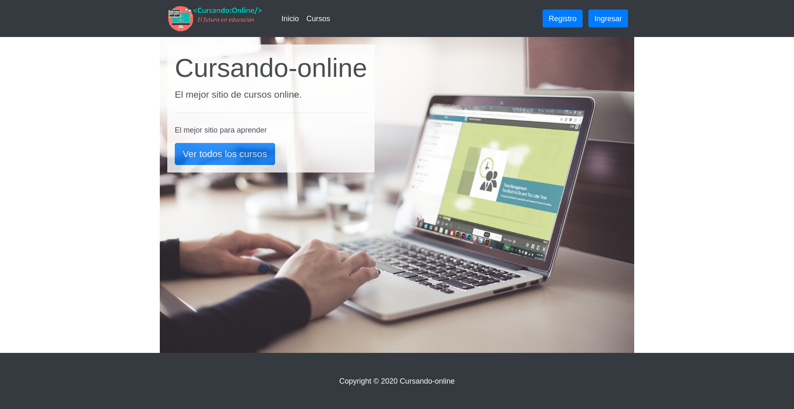

# Trabajo práctico especial de web 2 TUDAI- Grupo Ballone Gabriel y Cinalli Ezequiel

Este proyecto simula un sitio web de cursos online, w los cursos están agrupados en categorías.

Sin loguearse se puede ver el listado de cursos y categorías, así como un curso en especifico en más detalle.

Registrándose se creará un usuario no administrador, el cual logueándose solo tendrá permiso para editar su perfil.
El sitio cuenta con un área de administración que se accede logueandose con un usuario administrador, a través de un botón desplegable en la barra de navegación. En este área se puede hacer abm de cursos o categorías y se puede editar el permiso de administrador o eliminar un usuario.

### Instalación:

1.Clonar repositorio
2.Generar nueva base de datos MySQL con nombre: "db_cursandoonline"
3.Importar dentro de la BD el archivo SQL "db\db_cursandoonline.sql"

### Usuarios:

| Email                       | Password | Administrador |
| --------------------------- | -------- | ------------- |
| ezequielcinalli96@gmail.com | 123      | Si            |
| gaballone@hotmail.com       | 123      | Si            |
| noadmin@gmail.com           | 123      | No            |
